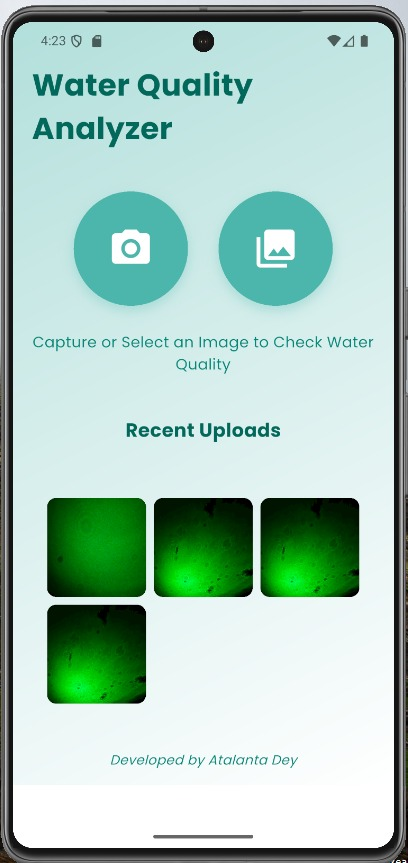
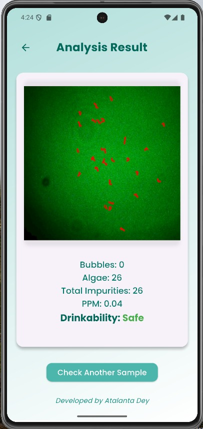
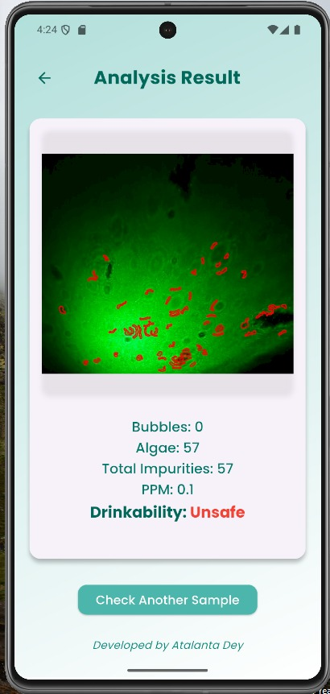

# LaserDrop - Water Quality Analyzer (Final Year Project)

 <!-- Replace with your app logo if you have one -->

**LaserDrop** is a Flutter-based mobile application designed to analyze water quality by detecting impurities such as algae and air bubbles in water samples. The app uses image processing techniques to provide detailed analysis, including the concentration of impurities (in PPM) and the drinkability of the water based on WHO standards. It features a user-friendly interface for capturing or selecting images, viewing analysis results, and tracking recent uploads.

## Features

- **Image Capture and Selection**: Capture a water sample image using the camera or select one from the gallery.
- **Water Quality Analysis**:
  - Detects algae and air bubbles in the image.
  - Calculates total impurities and PPM (parts per million).
  - Determines drinkability ("Safe" or "Unsafe") based on WHO standards.
- **Processed Image Display**: Shows the analyzed image with marked impurities (red circles for bubbles, green circles for algae).
- **Recent Uploads**: Displays a 3x3 grid of recent uploads for quick access to past analyses.
- **Responsive Design**: Adapts to different screen sizes for a seamless experience on various devices.
- **Error Handling**: Provides clear error messages for network issues or failed analyses.

## Screenshots

### Home Screen
The home screen allows users to capture a new image or select one from the gallery. It also displays recent uploads in a 3x3 grid.

### Result Screen
The result screen displays the analysis results, including the number of bubbles, algae, total impurities, PPM, and drinkability. The processed image is shown with marked impurities.

## Setup Instructions

### Prerequisites
- **Flutter**: Ensure you have Flutter installed (version 3.0.0 or higher). [Install Flutter](https://flutter.dev/docs/get-started/install)
- **Python**: Required for the backend server (version 3.8 or higher). [Install Python](https://www.python.org/downloads/)
- **Git**: For cloning the repository. [Install Git](https://git-scm.com/downloads)

### Usage
**Launch the App:**
Ensure the Flask server is running.
Run the Flutter app on your device or emulator.
**Analyze Water Quality:**
On the home screen, tap the camera or gallery button to capture or select an image of a water sample.
The app will compress the image, send it to the backend for analysis, and display the results on the result screen.
**View Recent Uploads:**
Scroll down on the home screen to see a 3x3 grid of recent uploads.
Tap on any recent upload to view its analysis result.
**Return to Home Screen:**
From the result screen, tap the back button or the "Check Another Sample" button to return to the home screen.

### Future Prospects
LaserDrop is currently using traditional image processing techniques (via OpenCV) to detect algae and air bubbles in water samples. However, to improve the accuracy and robustness of the analysis, the following enhancements are planned:

***Integration of Machine Learning Models:***
*Replace the current OpenCV-based detection with a machine learning model (e.g., a Convolutional Neural Network or CNN) for more accurate identification of impurities.*
*Use pre-trained models like YOLO (You Only Look Once) or Faster R-CNN for object detection, fine-tuned to detect algae, air bubbles, and other water impurities.*
*Integrate the model into the Flask backend using frameworks like TensorFlow or PyTorch, allowing the app to send images to the server for ML-based analysis.*
**Training a Custom Model:**
*Collect a dataset of water sample images with labeled impurities (e.g., algae, air bubbles, sediments). This dataset can be created by manually annotating images using tools like LabelImg or MakeSense.*
*Train a custom machine learning model on this dataset to improve detection accuracy for specific water quality scenarios.*
*Use data augmentation techniques (e.g., rotation, scaling, brightness adjustments) to increase the dataset size and improve model generalization.*
*Deploy the trained model to the Flask backend, ensuring it can handle real-time inference for images uploaded by users.*
**Real-Time Analysis and Edge Computing:**
*Explore on-device ML model inference using Flutter plugins like tflite_flutter to perform analysis directly on the user’s device, reducing dependency on the backend server and improving performance in low-network conditions.*
*Optimize the model for mobile devices using techniques like quantization and pruning to reduce its size and inference time.*
**Expanded Impurity Detection:**
*Extend the model to detect additional impurities such as microplastics, sediments, and chemical residues, providing a more comprehensive water quality analysis.*
*Incorporate additional water quality metrics (e.g., pH, turbidity) by integrating IoT sensors that can communicate with the app via Bluetooth or Wi-Fi.*
**User Feedback and Model Improvement:**
Implement a feedback mechanism in the app where users can rate the accuracy of the analysis results.
Use this feedback to continuously improve the model by retraining it with new data, ensuring it adapts to diverse water sample conditions over time.
These enhancements aim to make LaserDrop a more accurate, efficient, and versatile tool for water quality analysis, potentially benefiting environmental researchers, water treatment facilities, and individuals in regions with limited access to clean water.

### Technologies Used 
*Frontend*: Flutter, Dart
*Backend*: Flask, Python
*Image Processing*: OpenCV
*Testing*: Mockito, Flutter Test
*Storage*: SharedPreferences for local storage
Contributing
Contributions are welcome! Please fork the repository and create a pull request with your changes. Ensure your code follows the existing style and includes tests.

Developer
Developed by **Atalanta Dey**
